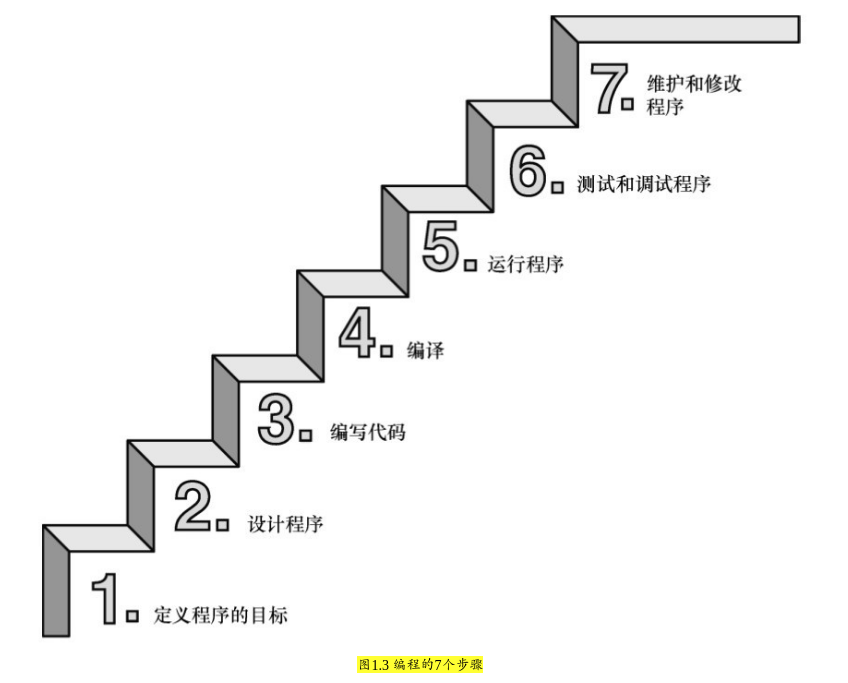

### 1.7 使用C语言的7个步骤



#### 1.7.1 第1步：定义程序的目标


#### 1.7.2 第2步：设计程序


#### 1.7.3 第3步：编写代码
* 程序清单1.1 C源代码示例
```
#include　<stdio.h>
int　main(void)
{
    int　dogs;
    printf("How　many　dogs　do　you　have?\n");
    scanf("%d",　&dogs);
    printf("So　you　have　%d　dog(s)!\n",　dogs);
    return　0;
}
```


#### 1.7.4 第4步：编译
* C 编译器负责把C代码翻译成特定的 *机器语言*

* 此外，C编译器还将源代码与C库（库中包含大量的标准函数供用户使用，如 `printf()` 和 `scanf()` ）的代码合并成最终的程序（更精确地说，应该是由一个被称为 **链接器** 的程序来链接 *库函数*，但是在大多数系统中，*编译器运行链接器*）

* 编译器还会检查C语言程序是否有效。如果C编译器发现错误，就不生成可执行文件并报错。


#### 1.7.5 第5步：运行程序


#### 1.7.6 第6步：测试和调试程序


#### 1.7.7 第7步：维护和修改代码
