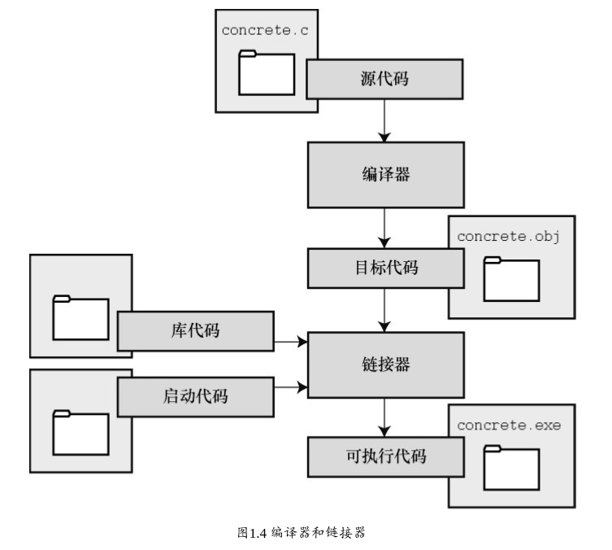
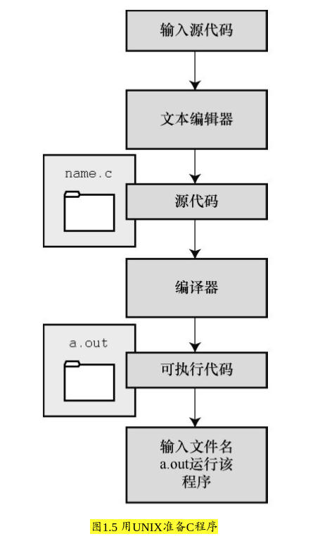

### 1.8 编程机制
* 编写的内容被储存在文本文件中，该文件被称为 **源代码文件**（source code file）

* 大部分C系统，包括之前提到的，都要求文件名以 **.c** 结尾
    * 在文件名中，点号（.）前面的部分称为 *基本名*（basename）

    * 点号后面的部分称为 *扩展名*（extension）

* 程序清单1.2 c程序 -- concrete.c
```c
#include　<stdio.h>
int　main(void)
{
    printf("Concrete　contains　gravel　and　cement.\n");
    return　0;
}
```


#### 1.8.1 目标代码文件、可执行文件和库 -- (REVIEW)
* C编程的基本策略是，用程序把源代码文件转换为可执行文件（其中包含可直接运行的机器语言代码）

* 典型的C实现通过 **编译** 和 **链接** 两个步骤来完成这一过程。
    * **编译器** 把源代码转换成中间代码，

    * **链接器** 把中间代码和其他代码合并，生成可执行文件。

* C 使用这种分而治之的方法方便对程序进行 **模块化**，
    * 可以独立编译单独的模块，稍后再用链接器合并已编译的模块。通过这种方式，如果只更改某个模块，不必因此重新编译其他模块。

    * 另外，链接器还将你编写的程序和预编译的库代码合并。

* > 中间文件有多种形式。我们在这里描述的是最普遍的一种形式，即把源代码转换为机器语言代码，并把结果放在 **目标代码** 文件（或简称目标文件）中（这里假设源代码只有一个文件）
    * 目标代码文件缺失启动代码（startup code）. 启动代码充当着程序和操作系统之间的接口.

    * 目标代码还缺少库函数. 几乎所有的C程序都要使用C标准库中的函数.

* **链接器** 的作用是，把你编写的目标代码、系统的标准启动代码和库代码这 3 部分合并成一个文件，即 **可执行文件**。
    * 对于库代码，链接器 *只会把程序中要用到的库函数代码提取出来*（见图)

    * (REVIEW) 

    * > 简而言之，目标文件和可执行文件都由机器语言指令组成的。然而:
        * **目标文件(代码)** 中只包含编译器为你编写的代码翻译的机器语言代码
        * **可执行文件(代码)** 中还包含你编写的程序中使用的库函数和启动代码的机器代码


#### 1.8.2 UNIX系统 -- (REVIEW)
1. 在UNIX系统上编辑
    * inform.c
    ```c
    #include　<stdio.h>
    int　main(void)
    {
        printf("A　.c　is　used　to　end　a　C　program　filename.\n");
        return　0;
    }
    ```

2. 在UNIX系统上编译
    * 我们需要编译器将我们编写的代码（源代码）翻译成计算机能看懂的代码（**机器代码**）

    * 以前，UNIX C编译器要调用语言定义的 `cc` 命令。但是，它没有跟上标准发展的脚步，已经退出了历史舞台

    * 但是，UNIX系统提供的C编译器通常来自一些其他源，然后以 `cc` 命令作为 *编译器的别名*

    * 编译inform.c: `cc inform.c`, 得到 `a.out` (**可执行文件**)
        * `./a.out` 运行可执行文件， 看到输出内容 “A .c is used to end a C program filename.”

    * (REVIEW) 

    * > 如果要储存可执行文件（a.out），应该把它重命名。否则，该文件会被下一次编译程序时生成的新 a.out 文件替换。

    * > 如何处理 *目标代码*？
        * C 编译器会创建一个与源代码基本名相同的目标代码文件，但是其扩展名是 **.o**。
        * 在该例中，目标代码文件是 `inform.o`。然而，却找不到这个文件，因为 *一旦链接器生成了完整的可执行程序，就会将其删除*。
        * 如果原始程序有多个源代码文件，则 *保留目标代码文件*。学到后面多文件程序时，你会明白到这样做的好处
        * PS: 这里的步骤跳跃了， 少了生成 .o 文件的步骤


#### 1.8.3 GNU编译器集合和LLVM项目
* GNU编译器集合（也被称为 **GCC**，其中包含GCC C编译器）是该项目的产品之一。

* `gcc -v` 或 `cc -v` 查看你所使用的编译器及其版本

* gcc和clang命令都可以根据不同的版本选择运行时选项来调用不同C标准。
```
gcc -std=c99 inform.c[3]
gcc -std=c1x　inform.c
gcc -std=c11　inform.c
```


#### 1.8.4 Linux系统
* Linux中准备C程序与在UNIX系统中几乎一样，不同的是要使用GNU提供的GCC公共域C编译器

* `gcc inform.c`


#### 1.8.5 PC的命令行编译器
* C编译器不是标准Windows软件包的一部分，因此需要从别处获取并安装C编译器。

* 可以从互联网免费下载Cygwin和MinGW，这样便可在PC上通过命令行使用GCC编译器。


#### 1.8.6 集成开发环境（Windows）
* Microsoft Visual Studio
