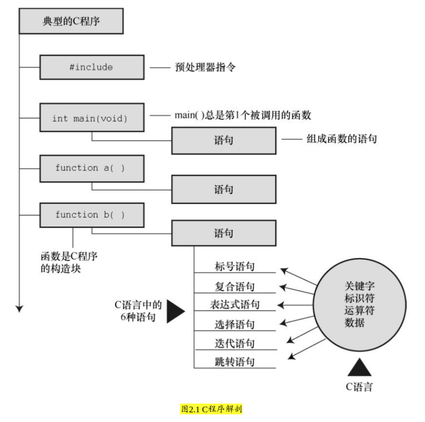

### 2.2 示例解释
* 图2.1 C程序解剖

#### 2.2.1 第1遍：快速概要
* `# include<stdio.h>`  ← 包含另一个文件
    * 该行告诉 **编译器** 把 `stdio.h` 中的内容包含在当前程序中。

    * `stdio.h` 是C编译器软件包的标准部分，它提供键盘输入和屏幕输出的支持。

* `int main(void)`  ← 函数名
    * C程序包含一个或多个函数，它们是C程序的基本模块

    * 圆括号表明 `main()` 是一个函数名

    * `int` 表明 `main()` 函数返回一个整数

    * `void` 表明 `main()` 不带任何参数

    * **现在，只需记住 int 和 void 是标准ANSI C定义 main()的一部分**

* `/* 一个简单的C程序 */`  ← 注释

* 函数体 ... 声明 ... 赋值表达式语句 ... 调用另一个函数 ... `\n` 另起一行 ... return 语句
