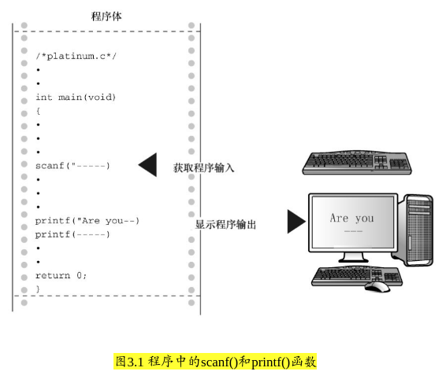

### 3.1 示例程序
* 3.1 platinum.c
```c
#include <stdio.h>

int main(void)
{
    float weight; // 体重
    float value; // 相等重量的白金价值

    printf("Are you worth your weight in platinum?\n");
    printf("Lets check it out.\n");
    printf("Please enter your weight in pounds:");

    // 获取用户的输入
    scanf("%f", &weight);

    // 假设白金的价格是每盎司 $1700
    // 14.5833 用于把英镑常衡盎司转换为金衡盎司
    value = 1700.0 * weight * 14.5833;

    printf("Your weight in platinum is worth $%.2f.\n", value);
    printf("You are easily worth that! If platinum prices drops,\n");
    printf("eat more to maintain your value.\n");

    return 0;
}
```

* 提示 错误与警告
    * 编译器会告诉你语法错误消息

    * 即使输入正确无误，编译器也可能给出一些警告，如“警告：从double类型转换成float类型可能会丢失数据”

    * 如果输入字母而不是数字，会导致程序出问题。这个问题要用if语句来解决（详见第7章），因此请先输入数字。


* 程序调整
    * 即使用第2章介绍的方法，在程序中添加下面一行代码： getchar(); (如果屏幕一闪而过则调用两次 getchar)

    * `getchar()` 函数读取 **下一个输入字符**，因此程序会等待用户输入。
        * 在这种情况下，键入 156 (相当于没有 getchar 下输入 56) 并按下Enter（或Return）键（发送一个换行符），然后scanf()读取键入的数字，第1个getchar()读取换行符，第2个getchar()让程序暂停，等待输入。


#### 3.1.1 程序中的新元素
* 在 `printf()` 中使用 `%f` 来处理浮点值。 `%.2f` 中的 .2 用于精确控制输出，指定输出的浮点数只显示 *小数点后面两位*

* `scanf()` 函数用于读取键盘的输入。
    * `%f` 说明 `scanf()` 要读取用户从键盘输入的浮点数，`&weight` 告诉 `scanf()` 把输入的值赋给名为 weight 的变量
    * `scanf()` 函数使用 `&` 符号表明找到 weight 变量的地点

* 
