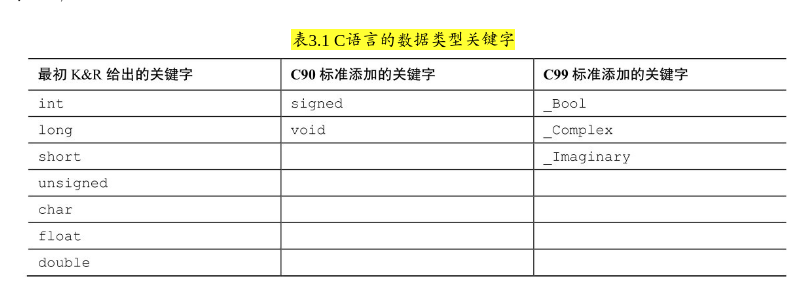
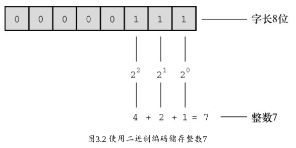
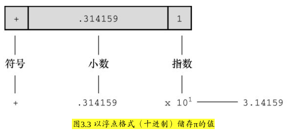

### 3.3 数据：数据类型关键字

* 了解一下 C语言的基本类型关键字:
    * K&C给出了 7个 与类型相关的关键字

    * C90标准添加了2个关键字，C99标准又添加了3个关键字

    * 

* `int` 关键字来表示基本的 **整数类型**。
    * 后3个关键字（`long`、`short`和`unsigned`）和C90新增的`signed`用于提供基本整数类型的变式
    * 例如`unsigned short int`和`long long int`

* `char` 关键字用于 指定 **字母** 和其他 **字符**（如，#、$、%和*）
    * 另外，char类型 *也可以* 表示较小的整数。

* `float`、`double`和`long double`表示带小数点的数

* `_Bool` 类型表示布尔值（`true`或`false`）

* `_complex`和`_Imaginary`分别表示复数和虚数

* 通过这些关键字创建的类型， *按计算机的储存方式* 可分为两大基本类型： **整数类型** 和 **浮点数类型**

#### 位、字节和字 (REVIEW)
* *位*、*字节* 和 *字* 是描述计算机数据单元或存储单元的术语。这里主要指 **存储单元**。

* 最小的存储单元是 **位**（**bit**），可以储存 0 或 1（或者说，位用于设置“开”或“关”）

* **字节**（**byte**）是 *常用的计算机存储单位*。对于几乎所有的机器，**1 字节均为 8 位**
    * 既然 1位 可以表示 0 或 1，那么 **8位字节就有 256（*2的8次方*）种可能的0、1的组合**

    * 通过二进制编码（仅用0和1便可表示数字），便可表示 **0～255** 的 **整数** 或 **一组字符**
        * PS: **一个字节能表示最大的整数是 255**， 因为 0 占了一个（常常忽略了 0）

        * （第15章将详细讨论二进制编码，如果感兴趣可以现在浏览一下该章的内容）。

* **字**（**word**）是设计计算机时给定的 *自然存储单位* (PS: 好像很少听到这个单位)
    * 对于8位的微型计算机（如，最初的苹果机）， 1个字长只有8位。从那以后，个人计算机字长增至16位、32位，直到目前的64位。

    * 计算机的字长越大，其数据转移越快，允许的内存访问也更多。

#### 3.3.1 整数和浮点数
* 无

#### 3.3.2 整数
* 整数是没有小数部分的数

* 计算机 *以二进制数字储存整数*，例如，整数7以二进制写是111 (`00000111`)
    * **因此**，要在8位字节中储存该数字，需要把前 5位 都设置成 0，后 3位 设置成 1（如图3.2所示）

    * 

#### 3.3.3 浮点数  (REVIEW)
* 注意，在一个值后面加上一个小数点，该值就成为一个浮点值
    * 所以，7 是整数，7.00 是浮点数

    * 书写浮点数有多种形式 (什么科学计数法。。。)

    * 3.16E7 表示（3.16 乘以10 的7次方）, 在十进制下，可以把 7.0 写成 `0.7E1`
        * 0.7 是 **小数部分**，1 是 **指数部分** (所以计算机里的浮点数就是这么组成的)

* 浮点数可以表示的范围比整数大

* 对于一些算术运算（如，两个很大的数相减），浮点数损失的 **精度** 更多

* 

* 因为在任何区间内（如，1.0 到 2.0 之间）都存在 *无穷多个* **实数**，*所以计算机的浮点数不能表示区间内所有的值*
    * 浮点数通常只是实际值的 **近似值**。

    * 例如，7.0可能被储存为浮点值6.99999。
