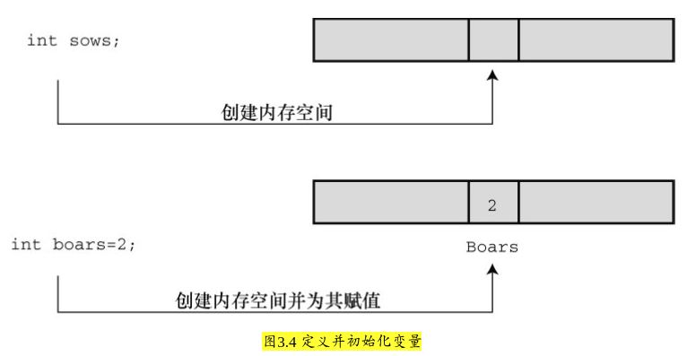
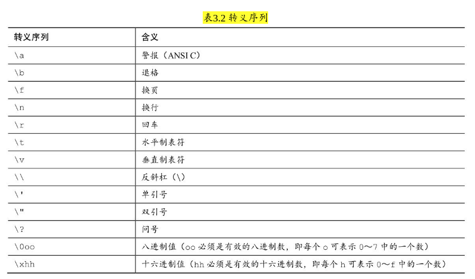
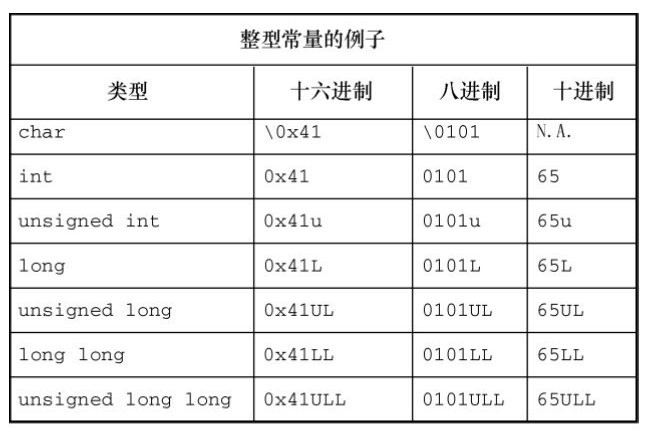
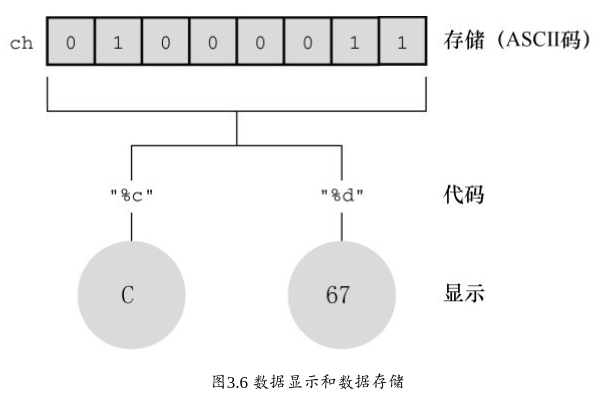

#### 3.4.1 int类型
* C语言中的整数类型可表示不同的取值范围和正负值

* int类型是有符号整型，即int类型的值必须是整数，可以是 *正整数、负整数或零*

* 一般而言，储存一个int要占用一个机器字长。
    * 因此，早期的16 **位** IBM PC兼容机使用16位来储存一个int值，其取值范围（即int值的取值范围）是-32768～32767。

    * 目前的个人计算机一般是64位，因此用64位储存一个int值.

##### 1.声明int变量
```
int erns;
int hogs, cows, goats;
```

* 第2种途径是，通过函数（如，`scanf()`）获得值


##### 2.初始化变量
* *初始化（initialize）* 变量就是为变量赋一个初始值

* int dogs, cats = 94; // 有效，但是这种格式很 *糟糕*
    * 以上示例的最后一行，只初始化了cats，并未初始化dogs。这种写法很容易让人误认为dogs也被初始化为94

* 简而言之，声明为变量创建和标记存储空间，并为其指定初始值:
    * 


##### 3.int类型常量
* 上面示例中出现的整数（21、32、14和94）都是 **整型常量** 或 **整型字面量**

* C语言把 *大多数整型常量* 视为int类型，但是非常大的整数除外


##### 4.打印int值
* 可以使用 `printf()` 函数打印int类型的值
    * `%d` 指明了在一行中打印整数的位置

* 程序清单3.2 print1.c程序
```c
#include <stdio.h>

int main(void)
{
    int ten = 10;
    int two = 2;

    printf("Doing it right: \n");
    printf("%d munis %d is %d\n",ten, 2, ten - two);

    printf("Doing is wrong:");
    printf("%d minus %d is %d\n", ten); // 遗漏了两个参数 -- gcc 编译的时候会报　warning　（语法检测工具也能检查出来）

    return 0;
}
```

* 在第二行输出中，第1个%d对应ten的值，但是由于没有给后两个%d提供任何值，所以打印出的值是 *内存中的任意值*
    * 读者在运行该程序时显示的这两个数值会与输出示例中的数值不同，因为内存中储存的数据不同，而且编译器管理内存的位置也不同

    * 你可能会抱怨编译器为何不能捕获这种明显的错误，但实际上问题出在 printf()不寻常的设计。

    * 大部分函数都需要指定数目的参数，编译器会检查参数的数目是否正确


##### 5.八进制和十六进制 (REVIEW)
* C语言都假定整型常量是十进制数

* 然而，许多程序员很喜欢使用八进制和十六进制数。 *因为8和16都是2的幂*，而10却不是。

* 八进制和十六进制记数系统在表达与计算机相关的值时很方便
    * 例如，十进制数 65536 经常出现在 *16位* 机中，用 *十六进制* 表示正好是 10000

* 另外，十六进制数的每一位的数恰好由4位二进制数表示
    * 例如，十六进制数 3 是0011，十六进制数 5 是0101, 因此，十六进制数 35 的位组合（bit pattern）是 00110101, 十六进制数53的位组合是 01010011

    * 这种对应关系使得 十六进制 和 二进制 的转换非常方便

* 但是，计算机如何知道10000是十进制、十六进制还是二进制？
    * 在C语言中，用特定的前缀表示使用哪种进制。

    * `0x` 或 `0X` *前缀* 表示 **十六进制值**，所以 十进制数16 表示成 十六进制 是 0x10 或 0X10。

    * `0` *前缀* 表示 **八进制**。例如， 十进制数16 表示成 八进制 是020

* 要清楚，使用不同的进制数是为了方便，不会影响数被储存的方式
    * 也就是说，**无论** 把数字写成 16 、020 或 0x10，储存该数的方式都相同，因为计算机内部都以二进制进行编码


##### 6.显示八进制和十六进制
* 在C程序中，既可以使用和显示不同进制的数, 不同的进制要 *使用不同的转换说明*
    * 以十进制显示数字，使用 `%d`

    * 以八进制显示数字，使用 `%o`

    * 以十六进制显示数字，使用 `%x`

    * 要显示各进制数的前缀 0、0x 和 0X，必须分别使用 `%#o`、`%#x`、`%#X`

* 程序清单3.3 bases.c程序
```c
#include <stdio.h>

int main(void)
{
    int x = 100;

    // dec = 100; octal = 144; hex = 64
    printf("dec = %d; octal = %o; hex = %x \n", x, x, x);

    // dec = 100; octal = 0144; hex = 0x64
    printf("dec = %d; octal = %#o; hex = %#x \n", x, x, x);

    return 0;
}
```


#### 3.4.2 其他整数类型 (REVIEW)
* 有助于理解 mysql 字段的设计

* C语言提供3个附属关键字修饰基本整数类型：`short`、`long` 和 `unsigned`。应记住以下几点
    * `short int`类型（或者简写为short）占用的存储空间可能比int类型少，常用于较小数值的场合以节省空间。与int类似，short是 *有符号类型* 。

    * `long int` 或 `long` 占用的存储空间可能比int多，适用于较大数值的场合。与int类似，long是 *有符号类型*。

    * `long long int` 或 `long long`（C99标准加入）占用的储存空间可能比long多，适用于更大数值的场合。该类型至少占64位。与int类似，long long 是 *有符号类型*。

    * `unsigned int` 或 `unsigned` **只用于非负值** 的场合。这种类型与有符号类型表示的范围不同。
        * 例如，16位unsigned int允许的取值范围是0～65535，而不是-32768～32767。用于表示正负号的位现在用于表示另一个二进制位，所以无符号整型可以表示更大的数。

    * 在C90标准中，添加了unsigned long int或unsigned long和unsigned int或unsigned short类型。

    * C99标准又添加了unsigned long long int或unsigned long long。

    * 在任何有符号类型前面添加关键字 `signed`，可强调使用有符号类型的意图。例如，short、short int、signed short、signed short int都表示同一种类型。


##### 1.声明其他整数类型
* 略


##### 2.使用多种整数类型的原因 (REVIEW)
* 为什么说short类型“可能”比int类型占用的空间少，long类型“可能”比int类型占用的空间多？
    * 因为C语言 **只** 规定了 short 占用的存储空间不能多于 int，long 占用的存储空间不能少于 int

    * 这样规定是为了适应不同的机器。例如，过去的一台运行Windows 3的机器上，int 类型和 short 类型都占16位，long 类型占32位

    * 后来，Windows和苹果系统都使用16位储存short类型，32位储存int类型和long类型（使用32位可以表示的整数数值超过20亿）

    * 现在，计算机普遍使用 64位 处理器，为了储存64位的整数，才引入了long long类型

* 现在，个人计算机上最常见的设置是，long long占64位，long占32位，short占16位，int占16位或32位（依计算机的自然字长而定）


* C 标准对基本数据类型 **只** 规定了允许的最小大小。
    * 对于 16 位机，short 和 int 的最小取值范围是[−32767,32767]；

    * 对于32位机，long的最小取值范围是[−2147483647,2147483647]。

    * 对于unsigned short和unsigned int，最小取值范围是[0,65535]；

    * 对于unsigned long，最小取值范围是[0,4294967295]。

    * long long类型是为了支持64位的需求，最小取值范围是[−9223372036854775807,9223372036854775807]；

    * unsigned long long的最小取值范围是[0,18446744073709551615]。如果要开支票，这个数是一千八百亿亿（兆）六千七百四十四万亿零七百三十七亿零九百五十五万一千六百一十五。但是，谁会去数？


##### 3.long常量和long long常量
* 通常，程序代码中使用的数字（如，2345）都被储存为int类型: 超过就 int => long int => unsigned long => long long

* 有些情况下，需要编译器 **以long类型储存一个小数字**
    * 要把一个较小的常量作为long类型对待，可以在值的末尾加上 `l`（小写的L）或 `L` 后缀。

    * 使用L后缀更好，因为l看上去和数字1很像。

    * l或L后缀也可用于八进制和十六进制整数，如020L和0x10L


##### 整数溢出
* toobig.c-- 超出系统允许的最大int值
```c
#include <stdio.h>

int main(void)
{
    int i = 2147483647;

    unsigned int j = 4294967295;

    // 2147483647 -2147483648 -2147483647
    printf("%d %d %d\n", i, i+1, i+2);

    // 4294967295 0 1
    printf("%u %u %u\n", j, j+1, j+2);

    return 0;
}
```

* 可以把无符号整数j看作是汽车的里程表。当达到它能表示的最大值时，会重新从起始点开始


##### 4.打印short、long、long long和unsigned类型 (REVIEW)
* 打印 unsigned int 类型的值，使用 `%u` 转换说明；

* 打印 long 类型的值，使用 `%ld` 转换说明

* 如果系统中int和long的大小相同，使用%d就行。但是，这样的程序被移植到其他系统（int和long类型的大小不同）中会无法正常工作  

* 在 x 和 o 前面可以使用 l 前缀，`%lx` 表示以十六进制格式打印 long 类型整数`，%lo` 表示以八进制格式打印long类型整数

* 对于 short 类型，可以使用 h 前缀。`%hd` 表示以十进制显示 short 类型的整数，`%ho` 表示以八进制显示short类型的整数

* h 和 l 前缀都可以和 u 一起使用，用于表示无符号类型

* 程序清单3.4 print2.c程序
```c
#include <stdio.h>

int main(void)
{
    unsigned int un = 3000000000; // int为32位和short为16位的系统
    short end = 200;
    long big = 65537;
    long long verybig = 12345678908642;

    // un = 3000000000 and not -1294967296
    printf("un = %u and not %d\n", un, un);

    // end = 200 and 200
    printf("end = %hd and %d\n", end, end);

    // end = 65537 and not 65537 (PS: 原书是 big = 65537 and not 1， 因为是在 64位 计算机系统)
    printf("end = %ld and not %d\n", big, big);

    // verybig = 12345678908642 and not 12345678908642 （PS： 原书是 verybig= 12345678908642 and not 1942899938）
    printf("verybig = %lld and not %ld\n", verybig, verybig);

    return 0;
}
```

* **REVIEW**: 从书本里的输出结果（32位系统） 与 实际操作输出结果（64 位系统）对比， 充分体现了操作系统的位数对各种 int 的影响

* 第 1 行输出，对于无符号变量 un，使用 %d 会生成负值！其原因是，*无符号值 3000000000 和有符号值−129496296 在系统内存中的内部表示完全相同*
    * 因此，如果告诉printf()该数是无符号数，它打印一个值；如果告诉它该数是有符号数，它将打印另一个值

* 第2行输出，对于 short 类型的变量 end，在printf()中无论指定以short类型（%hd）还是int类型（%d）打印，打印出来的值都相同
    * 这是因为在给函数传递参数时，C编译器把short类型的值自动转换成int类型的值

    * 你可能会提出疑问：为什么要进行转换？h修饰符有什么用？
        * 第1个问题的答案是， *int类型被认为是计算机处理整数类型时最高效的类型*。因此，在short和int类型的大小不同的计算机中，用int类型的参数传递速度更快

        * 第2个问题的答案是，使用 h 修饰符可以显示较大整数被截断成 short 类型值的情况

* 第 3 行输出就演示了这种情况。把 65537 以二进制格式写成一个 **32 位** (32 位的系统)数是 00000000000000010000000000000001。使用 %hd，printf()只会查看后 *16 位*，所以显示的值是 1。

* 与此类似，输出的最后一行先显示了verybig的完整值，然后由于使用了%ld，printf()只显示了储存在后32位的值。


#### 3.4.3 使用字符：char类型
* char类型用于储存字符（如，字母或标点符号）
    * 但是从技术层面看，char是整数类型, 因为char类型实际上储存的是整数而不是字符。

* 计算机使用数字编码来处理字符，即用特定的整数表示特定的字符。美国最常用的编码是ASCII编码，本书也使用此编码
    * 例如，在ASCII码中，整数65代表大写字母A

    * 另外，其他国家的计算机系统可能使用完全不同的编码

* 标准ASCII码的范围是 **0～127**，只需 7位二进制数 即可表示
    * 通常，char类型被定义为8位的存储单元，因此容纳标准ASCII码绰绰有余

* 许多字符集都超过了127，甚至多于255。例如，日本汉字（kanji）字符集。
    * 商用的统一码（**Unicode**）创建了一个能表示世界范围内多种字符集的系统，目前包含的字符已超过110000个。

    * 国际标准化组织（ISO）和国际电工技术委员会（IEC）为字符集开发了ISO/IEC 10646标准。统一码标准也与ISO/IEC 10646标准兼容。

* C语言把 **1字节** 定义为 **char类型占用的位（bit）数**，因此无论是16位还是32位系统，都可以使用char类型。

##### 1.声明char类型变量
* `char response; char itable, latan;`

##### 2.字符常量和初始化
* `char grade = 'A';`
    * 在C语言中，用 **单引号** 括起来的单个字符被称为 *字符常量（character constant）*

* C语言将字符常量视为int类型而非char类型。例如，在int为32位、char为8位的ASCII系统中，有下面的代码：
    * `char grade = 'B';` 本来'B'对应的数值66储存在32位的存储单元中，现在却可以储存在8位的存储单元中（grade）

    * （TODO: 没理解）利用用字符常量的这种特性，可以定义一个字符常量'FATE' （PS： 但是字符产量没办法这么定义啊, 这明明是字符串不是字符），即把4个独立的8位ASCII码储存在一个32位存储单元中。如果把这样的字符常量赋给char类型变量grade，只有最后8位有效。因此，grade的值是'E'。
        * 表示配合 char_test.c 就理解了：
        ```c
        #include <stdio.h>

        int main(void)
        {
            char grade = 'FATE'; // 所以这样定义是没问题的， 只报了 warning

            // E。 实际输出是最后一个字符
            // 即把4个独立的8位ASCII码储存在一个32位存储单元中。如果把这样的字符常量赋给char类型变量grade，只有最后8位有效
            printf("%c\n", grade);

            return 0;
        }
        ```

##### 3.非打印字符
* 单引号只适用于字符、数字和标点符号，浏览ASCII表会发现，有些ASCII字符打印不出来。
    * 例如，一些代表行为的字符（如，退格、换行、终端响铃或蜂鸣）。C语言提供了3种方法表示这些字符。

* *第1种方法* 前面介绍过——使用ASCII码。例如，蜂鸣字符的ASCII值是7，因此可以这样写： `char beep = 7;`

* *第2种方法* 是，使用特殊的符号序列表示一些特殊的字符。这些符号序列叫作转义序列（escape sequence）
    * `char nerf = '\n';` // 稍后打印变量nerf的效果是，在打印机或屏幕上另起一行。

    * 

    * 这些转义序列字符不一定在所有的显示设备上都起作用。例如，换页符和垂直制表符在PC屏幕上会生成奇怪的符号，光标并不会移动
        * **只有** 将其输出到 **打印机** 上时才会产生效果。

* 从C90开始，不仅可以用十进制、八进制形式表示字符常量，C语言还提供了第3种选择——用十六进制形式表示字符常量，即反斜杠后面跟一个x或X，再加上1～3位十六进制数字
    * 

* 何时使用ASCII码？何时使用转义序列？
    * 如果要在转义序列（假设使用'\f'）和ASCII码（'\014'）之间选择，请选择前者（即'\f'）。这样的写法不仅更好记，而且可移植性更高。'\f'在不使用ASCII码的系统中，仍然有效

##### 4.打印字符
* printf() 函数用 `%c` 指明待打印的字符
    * 如果用%d转换说明打印 char类型变量的值，打印的是一个整数

* 程序清单3.5 charcode.c程序:
```c
#include <stdio.h>

int main(void)
{
    char ch;

    printf("please enter a chatacter\n");

    scanf("%c\n", &ch); // 用户输入字符

    printf("the code for %c is %d.\n", ch, ch);

    return 0;
}
```

* 注意，printf()函数中的转换说明决定了数据的显示方式，而不是数据的储存方式（见图3.6）。
    * 


##### 5.有符号还是无符号
* 有些C编译器把char实现为有符号类型，这意味着char可表示的范围是-128～127。

* 而有些C编译器把char实现为无符号类型，那么char可表示的范围是0～255。

* 请查阅相应的编译器手册，确定正在使用的编译器如何实现char类型。或者，可以查阅 *limits.h头 文件*

* 根据C90标准，C语言允许在关键字 `char` 前面使用 `signed` 或 `unsigned` (这样就解决了不同编译器的问题)
