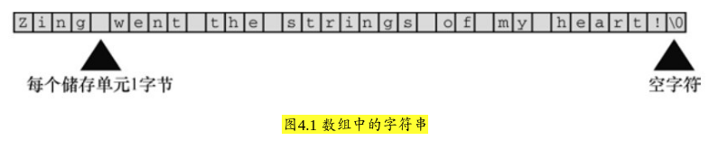
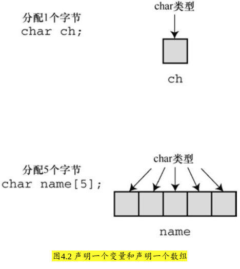
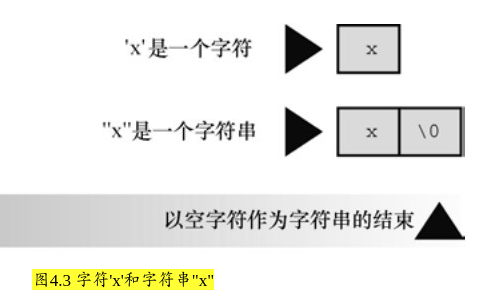

### 4.2 字符串简介
* **字符串（character string）** 是一个或多个 *字符的序列*
    * 是 字符的序列


#### 4.2.1 char 类型数组和 null 字符
* C语言没有专门用于储存字符串的变量类型，字符串都被储存在 char 类型的 **数组** 中。

* 数组由连续的存储单元组成，字符串中的字符被储存在相邻的存储单元中，每个单元储存一个字符（见图4.1）。

* 

* 注意图4.1中数组末尾位置的字符 `\0`。这是 *空字符（null character）*，C语言用它 **标记字符串的结束**。

* 空字符不是数字0，它是非打印字符，其ASCII码值是（或等价于）0。

* C中的字符串一定以空字符结束，这意味着数组的容量必须至少比待存储字符串中的字符数多1。
    * 空字符也占位置 (计算机自动处理)， 并且计入数组容量

    * 因此，程序清单4.1中有40个存储单元的字符串，*只能* 储存39个字符，剩下一个字节留给空字符

* 


#### 4.2.2 使用字符串
* 程序清单4.2 praise1.c程序
```c
#include <stdio.h>
#define PRAISE "You are an extraodinary being."

int main(void)
{
    char name[5];
6
    printf("Waht's your name?");

    // scanf 在遇到第1个空白（空格、制表符或换行符）时就不再读取输入
    scanf("%s", name);

    // %s告诉printf()打印一个字符串
    printf("Hello, %s.%s\n", name, PRAISE);

    return 0;
}
```

##### 字符串和字符
* *字符串* 常量"x"和 *字符* 常量'x'不同。
    * 区别之一在于'x'是基本类型（char），

    * 而"x"是派生类型（char数组；

* 


#### 4.2.3 strlen()函数
* strlen() 函数给出字符串中的字符长度

* 程序清单4.3 praise2.c程序
```c
#include <stdio.h>
#include <string.h>
#define PRAISE "You are an extraodinary being." // 30 个字符 + 1 个空字符

int main(void)
{
    char name[40];

    printf("What's your name?");

    // 输入 "Serendipity Chance"
    scanf("%s", name);

    // Hello,Serendipity.You are an extraodinary being.
    printf("Hello,%s.%s\n", name, PRAISE);

    // Your name of 11 letters occupies 40 memory cells.
    printf("Your name of %zd letters occupies %zd memory cells.\n", strlen(name), sizeof name);

    // The phrase of praise has 30 letters. （字符数: 眼见)
    printf("The phrase of praise has %zd letters\n", strlen(PRAISE));

    // and occupies 31 memory cells. (字节数: 计算机内部)
    printf("and occupies %zd memory cells.\n", sizeof PRAISE);

    return 0;
}
```

* `sizeof`: 字节数
    * sizeof 运算符给出的数更大，因为它 *把字符串末尾不可见的空字符也计算在内*

* `strlen()`: 字符串长度
    * strlen() 得出的也是字符串中的字符数（包括空格和标点符号）
