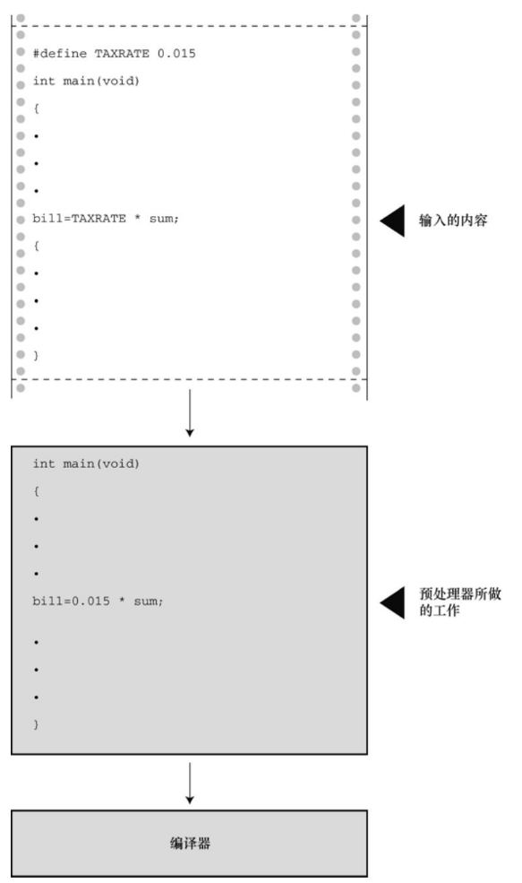
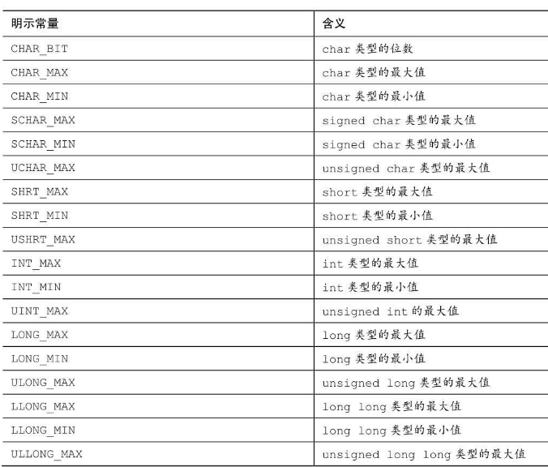
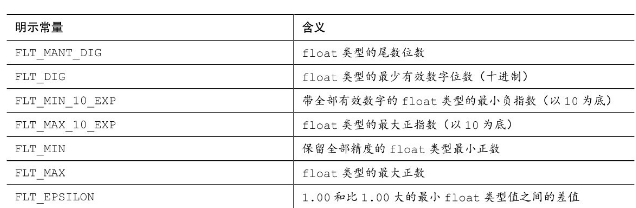

### 4.3 常量和C预处理器
* C 预处理器: `#define NAME value`
    * 请注意格式，首先是 `#define`，接着是符号 *常量* 名（TAXRATE），然后是符号常量的值

* `#define TAXRATE 0.015`
    * 编译程序时，程序中所有的 TAXRAT E都会被替换成 0.015。这一过程被称为 **编译时替换**（compile-time substitution）

* 

* 程序清单4.4 pizza.c程序
```c
#include <stdio.h>
#define PI 3.14159

int main(void)
{
    float area, circum, radius;

    printf("What is the radius of your pizza?\n");

    scanf("%f", &radius); // 输入半径

    area = PI * radius * radius; // 面积

    circum = 2.0 * PI * radius; // 周长

    printf("Your basic paiize parameters are as follows:\n");

    printf("circumference = %1.2f, area = %1.2f\n", circum, area);

    return 0;
}
```

* #define指令还可定义字符和字符串常量。前者使用单引号，后者使用双引号:
```c
#define BEEP '\a'
#define TEE 'T'
#define ESC '\033'
#define OOPS "Now you have done it!"
```


#### 4.3.1 const 限定符
* C90标准新增了 const 关键字，用于限定一个 *变量* 为只读
    * 在C语言中，用const类型限定符声明的是变量，*不是* 常量


#### 4.3.2 明示常量
* C头文件 limits.h 和 float.h 分别提供了与整数类型和浮点类型大小限制相关的详细信息。每个头文件都定义了一系列供实现使用的明示常量 [3]。例如，limits.h 头文件包含以下类似的代码：
```c
#define INT_MAX +32767
#define INT_MIN -32768
```

* 这些明示常量代表int类型可表示的最大值和最小值

* 

* 

* 程序清单4.5 defines.c程序
```c
#include <stdio.h>
#include <limits.h>
#include <float.h>

int main(void)
{
    printf("Some number limits for this system:\n");

    printf("Biggest int: %d\n", INT_MAX);

    printf("Smallest long long: %lld\n", LLONG_MIN);

    printf("One byte = %d bits on this system.\n", CHAR_BIT);

    printf("Largest double: %e\n", DBL_MAX);

    printf("Smallest normal float: %e\n", FLT_MIN);

    printf("float precision = %d digits\n", FLT_DIG);

    printf("float epsilon = %e\n", FLT_EPSILON);

    // Some number limits for this system:
    // Biggest int: 2147483647
    // Smallest long long: -9223372036854775808
    // One byte = 8 bits on this system.
    // Largest double: 1.797693e+308
    // Smallest normal float: 1.175494e-38
    // float precision = 6 digits
    // float epsilon = 1.192093e-07

    return 0;
}
```
