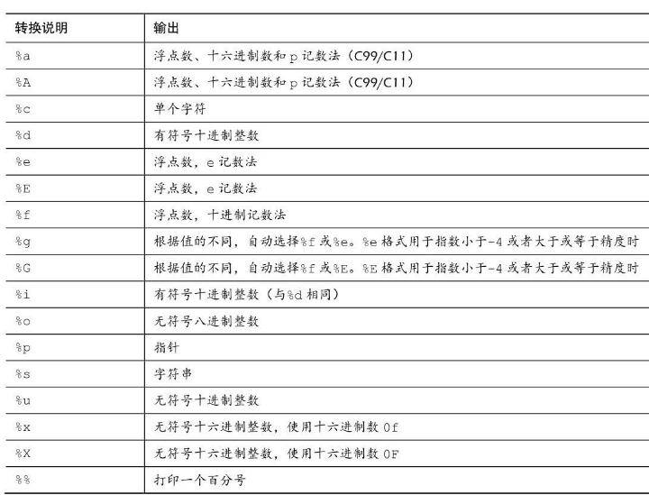

### 4.4 printf()和scanf()
* printf() 函数和 scanf() 函数能让用户可以与程序交流，它们是 *输入/输出函数*，或简称为 **/I/O函数**

* 这些函数和C库的一些其他函数一样， **并不是C语言定义的一部分**

* 最初，C把输入/输出的实现留给了编译器的作者，这样可以针对特殊的机器更好地匹配输入/输出。
    * 后来，考虑到兼容性的问题，各编译器都提供不同版本的printf()和scanf()。

* 虽然printf()是输出函数，scanf()是输入函数，但是它们的 *工作原理几乎相同*。两个函数都使用格式字符串和参数列表


#### 4.4.1 printf()函数
* 打印整数时使用 %d，打印字符时使用 %c 。这些符号被称为 *转换说明（conversion specification）*

* 


#### 4.4.2 使用printf()
* 程序清单4.6 printout.c程序
```c
#include <stdio.h>
#define PI 3.141593

int main(void)
{
    int number = 7;
    float pies = 12.75;
    int cost = 7800;

    printf("The %d contestants ate %f berry pies.\n", number, pies);

    printf("The value of pi is %f.\n", PI);

    printf("Farewell! thou art too dear for my processing,\n");

    printf("%c%d\n", '$', 2 * cost);

    return 0;
}
```

* 

* 警告
    * 格式字符串中的转换说明一定要与后面的每个项相匹配，若忘记这个基本要求会导致严重的后果


#### 4.4.3 printf()的转换说明修饰符
* 在 % 和转换字符之间插入 **修饰符** 可修饰基本的转换说明

* 

* 注意 类型可移植性
    * sizeof 运算符 **以字节为单位** 返回类型或值的大小

##### 注意 float参数的转换
* 

* 1.使用修饰符和标记的示例, 程序清单4.7 width.c程序
```c
#include <stdio.h>
#define PAGES 959

int main(void)
{
    // *959*
    printf("*%d*\n", PAGES);

    // *959*
    printf("*%2d*\n", PAGES);

    // *       959*
    printf("*%10d*\n", PAGES);

    // *959       *
    printf("*%-10d*\n", PAGES);

    return 0;
}
```
* 第2个转换说明是 `%2d`，其对应的输出结果应该是 2 字段宽度
* 第 3个转换说明是%10d，其对应的输出结果有10个空格宽度
* 最后一个转换说明是`%-10d`，其对应的输出结果同样是 10 个空格宽度，-标记说明打印的数字位于字段的左侧

* 程序清单4.8 floats.c程序, floats.c -- 一些浮点型修饰符的组合
```c
#include <stdio.h>

int main(void)
{
    const double RENT = 3852.99;

    // *3852.990000*
    printf("*%f*\n", RENT);

    // *3.852990e+03*
    printf("*%e*\n", RENT);

    // *3852.99*
    printf("*%4.2f*\n", RENT);

    // *3853.0*
    printf("*%3.1f*\n", RENT);

    // *  3852.990*
    printf("*%10.3f*\n", RENT);

    // * 3.853E+03*
    printf("*%10.3E*\n", RENT);

    // *+3852.99*
    printf("*%+4.2f*\n", RENT);

    // *0003852.99*
    printf("*%010.2f*\n", RENT);

    return -0;
}
```
* 第2个转换说明是%e。默认情况下，编译器在小数点的左侧打印1个数字，在小数点的右侧打印6个数字

* 程序清单4.9 flags.c程序, 演示一些格式标记
```c
#include <stdio.h>

int main(void)
{
    // 1f 1F 0x1f
    printf("%x %X %#x\n", 31, 31, 31);

    // **42** 42**-42**
    printf("**%d**% d**% d**\n", 42, 42, -42);

    // **    6**  006**00006**  006**
    printf("**%5d**%5.3d**%05d**%05.3d**\n", 6, 6, 6, 6);

    return 0;
}
```
* 第1行printf()语句中，根据`%x`打印出 1f，`%F`打印出1F，`%#x`打印出 0x1f。


##### 程序清单4.10 stringf.c程序
```c
#include "stdio.h"
#define BLURB "Authentic imitation!"

int main(void)
{
    // [Authentic imitation!]
    printf("[%2s]\n", BLURB);

    // [    Authentic imitation!]
    printf("[%24s]\n", BLURB);

    // [                   Authe]
    printf("[%24.5s]\n", BLURB);

    // [Authe                   ]
    printf("[%-24.5s]\n", BLURB);

    return 0;
}
```
* 注意，虽然第1个转换说明是`%2s`，但是字段被扩大为可容纳字符串中的所有字符。

* 还需注意，精度限制了待打印字符的个数。`.5`告诉`printf()`只打印5个字符。另外，`-`标记使得文本左对齐输出。


#### 4.4.4 转换说明的意义
* TODO: 剩下的部分， 后面再补！ 这一章内容太多了！！！
